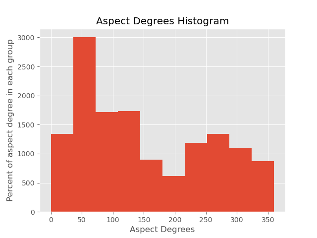

# Danger Mountain

The dataset I decided to use is avalanche data from the ski resorts inside of Davos, Switzerland.  The data ranged from the year 1998 up to 2019.  My data was drawn from Kaggle and was set up quite nicely to begin with.  It started with the avalanche number, the date of release, the snow type, trigger type, max and min elevation in meters, aspect degrees, length, width, perimeter length, area, size class, weight, and max danger correlation.

I changed my index to the avalanche number.  I also changed the dae_release to a date time.  And the snow type, triiger type to a catageroical.  Afer doing this I was ready to start my EDA.

link :https://www.envidat.ch/dataset/ce11efbe-4dac-4ff5-9a3d-f01e2c573292/resource/4c2b7c38-a874-45fc-9833-fdf83823067b/download/data_set_1_avalanche_observations_wi9899_to_wi1819_davos.csv

# EDA
1. Snow types
   - dry
   - wet
   - mixed
   - unknown
2. Trigger types
   - Human
   - Natural
   - Unknown
3. Different columns described
   - Aspect degrees:
     - A degree of the face of the mountain in relation to the sun.
   - Max danger
     - A ranking of 1-5 of the danger of the avalanche 1 being the worst.
   - Size class
     - A ranking of 1-5 of the size of the avalanche 1 being the smallest.

4. Here are a few statistics about my data:
   - Mean aspect degrees: 151.415
   - Median aspect degrees: 125.0
   - Mean impact area: 16638.671
   - Median impact area: 5624.5

To continue my EDA I plotted a few of my variables as histograms as well as a scatter plot to help me visualize the data.

    

    

    

# Hypothesis Test

For my hypothesis test I decided to test whether the mean area of avalanches with wet snow type is equal to the mean area with dry snow type.   
 
Listed below is my two tail null and alternate hypothesis:
- h0: mean area of dry avalanches = mean area of wet avalanches
- ha: mean area of dry avalanches != mean area of wet avalanches  
or
- h0 : mean area of dry avalaches - mean area of wet avalanches = 0
- ha: mean area of dry avalaches - mean area of wet avalanches != 0
 
Using a welches t-test I obtained a t-value of 0.01057, a p-value of 1.66 e-13, and a standard error of 1153.24.  Looking below at the graph of my test we can see that we are greater than 95% confident that our sample mean is outside -1153.24 and 1153.24.  As shown in the graph my actuall sample mean is represented by the green line which is far outside my distribution.  
 

    

 
- The p-value = 1.6599364216596502e-13, which is less than our significance level of 0.05, so we must reject the null hypothesis.
- The probability of seeing these sample means given the null hypothesis is true is 1.6599364216596502e-13
 

# Regressions
I conducted two regressions on my data.  First I wanted to see if a mountain with a northern and southern facing direction caused a larger avalanche.  Secondly I wanted to see if a large difference in elevation would cause a larger avalanche vs a smaller difference.    
 
My first step to do this regression is to visualize the data to get a better idea of what I am working with.  
 

    

 
As you can see above my data is not very good to be running regressions on.  It definitly violates some assumtions for a linear regression.  So for my north and south regression I used a quantile regression instead so that I do not violate the assumtions of a linear regression.  The assumptions of a quantile regression are linearity, no multicolinearity, and independence.  The quantile regression was a more appropraite model because my data is not very highly correlated and is not normally distributed.  
 
 
For my second regression the data is a little better to not violate the assumtions of a linear regression although it is far from perfect.  Below are two qqplots for each of my regressions showing that neither of my regressions data follow a normal distrubtion perfectly.  
 
 
First is the north and south quantile regression

    

 
Next is the difference in elevation linear regression

    

 
To further show how my second regression violates the assumtions for a linear regression, below is a residuals plot that shows how much heteroscedasticity is contained in my data.

    

 
Below is the summary table for my quantile regression, the effect on area from mountains tha face north and south. 

 

    

 
Conclusion: On average a single increase in aspect degree to the north or south direction leads to an increase in area of 226.33 meters2 using quantile regression.  My p-value is right on the cusp of the .05 significance level for rejecting the null hypothesis.  Which again can be seen in the confidence interval as it is very close to containing zero.  
 
Next is the summary table for my linear regression, the effect on area from difference in elevation.

 

    

 
Conclusion: On average a single increase is the difference in elevation leads to an increase in avalanche area of 198.6 meters2.  In this regression my data is at least a little bit correlated with each other.  But is not very normal according to the Durbin-Watson test.  Ignoring that my p-value is so small it is basically zero meaning my data is significant and there is a very small chance that my 95% confidence interval will contain zero.

# Avalanche data for Davos Switzerland 1999-2019
  link :https://www.envidat.ch/dataset/ce11efbe-4dac-4ff5-9a3d-f01e2c573292/resource/4c2b7c38-a874-45fc-9833-fdf83823067b/download/data_set_1_avalanche_observations_wi9899_to_wi1819_davos.csv
  
  1.Graphs:
  
    -Histogram of the aspect degrees of each avalanche
    
    -Scatter plot of aspect degrees and the danger 
    
    -Scatter of the aspect degrees and damage area
    
    -Plot snow types and avalanche size
    
    -Aspect degrees and length
    
  2.Possible regressions:
  
    -does a higher aspect degree mean a greater damage area?
    
    -Does a dry snow type cause a larger avalanche?
    
    -Does a wet snow type cause a larger avalanche?
    
  3.Statistics:
  
    -Mean avalache area
    
    -Mean aspect degrees
    
    -correlation of aspect degrees and avalanche area
  
    - Which seasons have the most natural avalanches?
  
  
